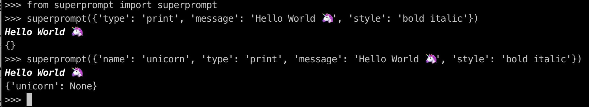

# questionary-superprompt

An extension to the python [questionary](https://github.com/tmbo/questionary) package that provides additional features for the questionary `prompt()` method.

## Overview

This includes a single function, `superprompt()` who's signature is identical to `questionary.prompt()` but extends the vanilla `prompt()` to add new `list` and `dict` question types, repeated prompts to ask the same question multiple times, and an `if` function which allows nested prompts to be asked only if a given critiera is met.  `superprompt()` also implements a `print` type which simply prints a message. (This is currently implemented in [questionary latest](https://github.com/tmbo/questionary/issues/207) but not yet the released version.) `superprompt()` aims to be 100% backwards compatible with `prompt()`.  `superprompt()` has 100% test coverage.

## Synopsis

### 'if' option for questions

The `if` option asks additional questions if the answer to the previous question matches the if condition. The if condition may be a value or a `callable`. If it is a `callable`, the `callable` will be called with the answer to the previous question and should return `True` or `False`. If you need to ask multiple questions based on the value of a previous question, this is easier than using a `when` option in each subsequent question.

```python
"""Demo `if` option for superprompt"""

from pprint import pprint

from superprompt import superprompt

questions = {
    "name": "ask_more_questions",
    "type": "confirm",
    "message": "Ask more questions?",
    "if": [
        True,
        [
            {"name": "question2", "type": "text", "message": "Enter some text:"},
            {"name": "question3", "type": "text", "message": "Enter some more text:"},
        ],
    ],
}

pprint(superprompt(questions))
```

```
$ python examples/example_if.py
? Ask more questions? Yes
? Enter some text: Hello
? Enter some more text: World
{'ask_more_questions': True, 'question2': 'Hello', 'question3': 'World'}

$ python examples/example_if.py
? Ask more questions? No
{'ask_more_questions': False}
```

### 'list' and 'dict' question types

Superprompt adds two new question types: `list` and `dict`. These types ask one or more nested questions, passed in the `questions` option, as a `list` or a `dict`, depending on the `type` used.

#### list type

```python
"""Demo `list` type for superprompt"""

from pprint import pprint

from superprompt import superprompt

questions = {
    "name": "list_values",
    "type": "list",
    "message": "message isn't needed for special list type",
    # every "list" type must include a "questions" option of questions to ask
    "questions": [
        {"name": "title", "type": "text", "message": "Enter book title:"},
        {"name": "author", "type": "text", "message": "Enter book author:"},
    ],
}

pprint(superprompt(questions))
```

```
$ python examples/example_list.py
? Enter book title: Dune
? Enter book author: Frank Herbert
{'list_values': ['Dune', 'Frank Herbert']}
```

#### dict type

```python
"""Demo `dict` type for superprompt"""

from pprint import pprint

from superprompt import superprompt

questions = {
    "name": "dict_values",
    "type": "dict",
    "message": "message isn't needed for special list type",
    # every "list" type must include a "questions" option of questions to ask
    "questions": [
        {"name": "title", "type": "text", "message": "Enter book title:"},
        {"name": "author", "type": "text", "message": "Enter book author:"},
    ],
}

pprint(superprompt(questions))
```

```
$ python examples/example_dict.py
? Enter book title: Dune
? Enter book author: Frank Herbert
{'dict_values': {'author': 'Frank Herbert', 'title': 'Dune'}}
```

### multiple option

Superprompt adds a `multiple: int` option that will ask a question `multiple` times and set the answer to a list of all values.  If `multiple` is positive, the question will be repeated exactly `multiple` times.  If `multiple` is negative, the question will be repeated at most `abs(multiple)` times and the user will be prompted each time to confirm if they want to add another value. The `multiple_message` option is used with `multiple` to replace the question `message` after the first prompt (e.g. `Enter another value` instead of `Enter a value`) when `multiple` is positive. When `multiple` is negative, the `multiple_message` will be used as the confirmation prompt  (as a `questionary.confirm` question) to prompt for another value, e.g. `Enter another value Y/n`.

```python
"""Demo `multiple` option for superprompt"""

from pprint import pprint

from questionary import print as qprint

from superprompt import superprompt

questions = {
    "name": "books",
    "type": "text",
    "message": "Name of a book you like:",
    "multiple": 3,  # <-- if multiple > 0, asks exactly multiple times
    "multiple_message": "Name of another book you like:",  # <-- used in place of `message` after the first question is asked
}
qprint("Ask for exactly 3 values (multiple=3)")
pprint(superprompt(questions))

questions = {
    "name": "books",
    "type": "text",
    "message": "Name of a book you like:",
    "multiple": -2,  # <-- if multiple < 0, asks up to abs(multiple) times
    "multiple_message": "Enter another book?",  # <-- used in place of `message` for the continuation prompt
}

qprint("Ask for up to 2 values (multiple=-2)")
pprint(superprompt(questions))
```

```
python examples/example_multiple.py
Ask for exactly 3 values (multiple=3)
? Name of a book you like: Dune
? Name of another book you like: Lord of the Rings
? Name of another book you like: Hyperion
{'books': ['Dune', 'Lord of the Rings', 'Hyperion']}
Ask for up to 2 values (multiple=-2)
? Name of a book you like: Dune
? Enter another book? Yes
? Name of a book you like: Lord of the Rings
{'books': ['Dune', 'Lord of the Rings']}
```

### print

The `print` type simply prints a message. `name` is optional, but if provided, will be included in the returned answers dict with a value of 'None'.

```
>>> from superprompt import superprompt
>>> superprompt({'type': 'print', 'message': 'Hello World 🦄', 'style': 'bold italic'})
Hello World 🦄
{}
>>> superprompt({'name': 'unicorn', 'type': 'print', 'message': 'Hello World 🦄', 'style': 'bold italic'})
Hello World 🦄
{'unicorn': None}
>>>
```



## Testing

100% coverage:

```
---------- coverage: platform darwin, python 3.10.5-final-0 ----------
Name             Stmts   Miss  Cover
------------------------------------
superprompt.py      70      0   100%
------------------------------------
TOTAL               70      0   100%
```
